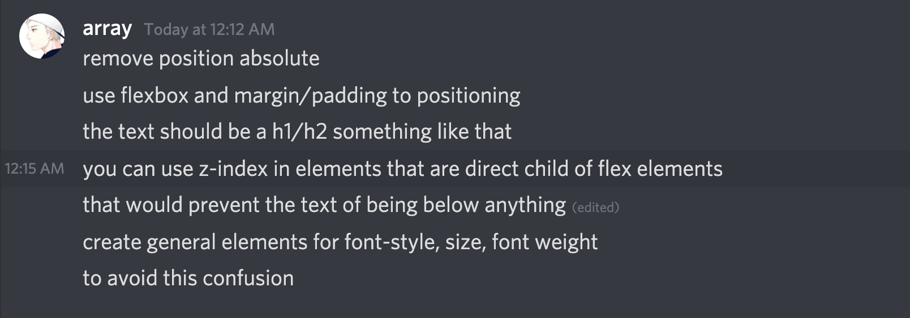

# Bugs

- Stepper icon turns into a different color once left
- Make the result boxes the same height
- Is reset on fridge necessary, also each time your cancel something in fridge filter it automatically updates for you
- Can't get search icon in fridge
- Icons in fridge not included unlessly we make some breaking changes to the code we wrote in step 1
- Some things are not responsive like the desc. in home page and the back button in empty your fridge frame
- Highlight underneath the name of the recipe generated is inconsistent
- Same as above, we would need to work some magic and have an intense code refactoring to get icons in step 3

# To do

- Frontend

  - Implement filter functionality
  - Substitutable ingredients functionality
  - Dish component to get all ingredients required and measurements

- Backend

  - share
  - download ( Generate pdf through pdfkit)
  - caching
  - Add testing to backend
  - Make the backend directory structure cleaner

- Infra-relatedish

  - Somehow get this out there, either do some magic with Trafeik and Docker Swarm or consider Dokku for backend
  - Otherwise docker-compose

# Advice

